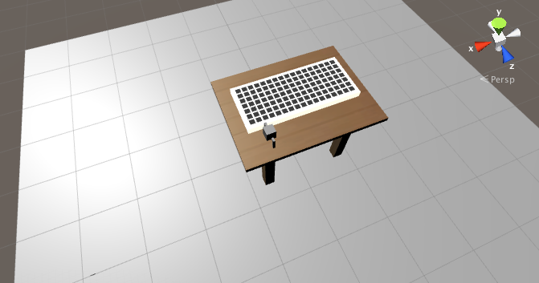
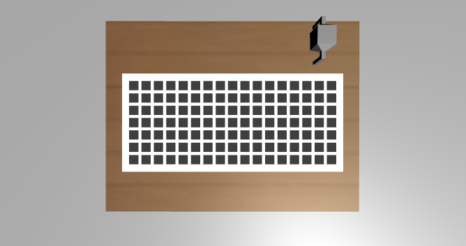
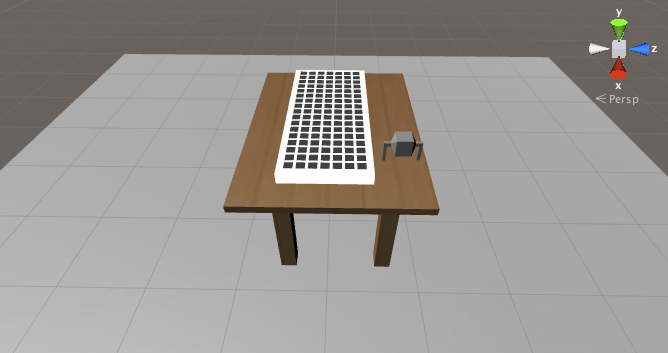

# Laboratório Virtual de Circuitos
> A proprosta deste software é simular um laboratório de circuitos elétricos.

Este é um software que simula em 3D o laboratório de circuitos elétricos da FEELT-UFU.







## Ambiente de Desenvolvimento

Arquivos como cronograma, documentação e projeto escrito estarão disponíveis na pasta do Google Drive do projeto.

[clique para acessar a pasta](https://drive.google.com/folderview?id=0B9-1PWnB4ejCeGpoZU9DbGRybW8&usp=sharing)


Para iniciar o desenvolvimento, baixe a versão mais nova do [Unity Editor](https://unity3d.com/pt/get-unity/download).
Clone o projeto em seu computador:
```sh
git clone https://github.com/italogfernandes/circuitos/
```
Então abra-o pelo Unity Editor, semelhante a imagem abaixo.


## Autores

Ítalo Fernandes – italogsfernandes@gmail.com

Kaio Saramago - kaiosaramago@yahoo.com.br

Trabalho orientado pelo professor [Carlos Eduardo Tavares](http://www.feelt.ufu.br/node/51).

Distribuido sobre a licença MIT. Veja ``LICENSE`` para mais informações.

[https://github.com/italogfernandes/circuitos](https://github.com/italogfernandes/circuitos)
